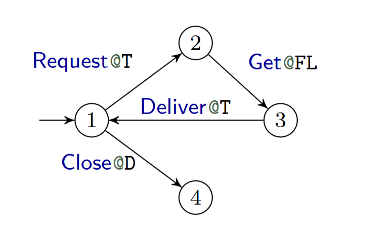

# SwarmProtocolVerification

This project contains a tool capable of converting a JSON representation of a swarm protocol as produced by https://github.com/Actyx/machines/tree/master to a representation that the model-checking tool UPPAAL (https://uppaal.org/) accepts.

It was created in conjunction with the work of the master's thesis titled Exploring the use of model based verification of swarm protocols. 

# Installation
To run the code Python 3.12 (https://www.python.org/downloads/release/python-3120/) or newer is required along with a version of UPPAAL (https://uppaal.org/downloads/) some features will only function with 5.1.0-beta5 otherwise 5.0.0 will do.

Once a working Python installation is working it should come with pip. Allowing for installing all requirements with:

    pip install -r requirements.txt

After this, the CLI can be run with:

    python .\src\CLI.py

# Example usage

Due to the nature of swarms and their propagation, it becomes extremely taxing to verify some queries when the propagation can happen in any order with any delay in between. Therefore the tool comes with a set of choices for how to delay propagation. 

DelayTypes:
* "N": Representing no delay in propagation, e.i. when a machine emits an event it immediately propagates.
* "E": Representing a delay of x global events after a machine emits an event. Propagation can happen anywhere between 0-x new global events emitted.
* "S": Representing a delay of x local events after a machine emits an event. Propagation can happen anywhere between 0-x new local events emitted.

Currently, it is only possible to pick one of the above choices. Meaning "E" and "S" cannot be set to a role at the same time.

Additionally, it is possible to delay propagation with given time constraints. Setting a maximum and minimum time for when propagation happens. Note that the countdown for propagation only begins after an event is emitted and is not reset before propagation happens. If "E" or "S" is set along with the time constraints then propagation will happen based on the DelayType even if the minimum time is not yet reached.

## time input in JSON format

When inputting time it happens in the form of a JSON format an example of said example could be:

    {
    "events": [
      {
        "logType": "e01",
        "min_time": 10,
        "max_time": 15
      },
      ...
    ],
    "logs": [
        {
          "role_name": "O",
          "min_time": 10,
          "max_time": 20
        },
        ...
      ]
    }
  

Where "events" holds the timing for each type of event and "logs" holds the delay
in propagation, it takes before the corresponding "role_name" propagates.
Note that either "min_time" or "max_time" can be excluded leaving only a lower or
upper bound for when the event or propagation happens.

## CLI

The tool comes equipped with a command line interface with the following commands:

    build               Build the model
    setArgs             Set the arguments for the build
    showArgs            Displays the current settings for the model
    loadState           Load state from path, overwriting internal state file
    writeState          Write internal state json file to path
    verify              Verifies a given model with a set of given queries
    autoVerify          Verifies a given model using automatically generated queries
    verifyLog           Verifies if a given global can exists in the model
    q                   Quit the CLI.

which can be viewed if using the "-h" command. Be aware that each command can be
run with the "-h" flag to see its exact usage as an example the command
"verify -h" gives the following ouput:

    positional arguments:
      model_path            Path to the UPPAAL xml file
      query_path            Path to the txt file containing newline seperated queries
    
    options:
      -h, --help            show this help message and exit
      -vp VERIFYTA_PATH [VERIFYTA_PATH ...], --verifyta-path VERIFYTA_PATH [VERIFYTA_PATH ...]
                            Path to the verifyta distribution if not specified local will be used

The CLI holds a state file that is preserved between executions so settings will 
be saved. The settings can be set using "setArgs" and are as follows:

* -vp path: Taking a path  to the verifyta tool and setting it in the local settings
* -pf path: taking a path to a folder. Will be used to find JSON input files
* -log n: Taking an integer n and setting the log size used in UPPAAL note that larger log sizes will slow down verification, however, if the log size is too small it will not investigate the entire state space
* -path n: Taking an integer n and setting the path bound for how many times non-exit paths in a model can be repeated, by every instance of a role. if set to a negative value no transition will be bounded.
* -dta d: Taking a dictionary d mapping role names to DelayTypes an example could be {"R1": "N", "R2": "E"}
* -bt b: Taking a boolean b and setting whether or not the model should use branch tracking.
* -dda d: Taking a dictionary d mapping role names to how many events can happen before propagation is forced {"R1": 1, "R2": 2}
* -ra d: Taking a dictionary d mapping role names to how many replicas of each role are used in the model, an example could be {"R1": 1, "R2": 2}

### Example usage

The first thing we have to do is set the correct path to a working verifyta tool which can be found in all reset UPPAAL distributions. This is done as follows:

    setArgs -vp path

Where "path" is replaced by the desired path.

Given a swarm as the following:

The json representation would be as follows:

    {
        "initial": "l0",
        "transitions": [
            {
                "label": {
                    "cmd": "Request",
                    "logType": ["Request"],
                    "role": "Transport"
                },
                "source": "l0",
                "target": "l1"
            },
            {
                "label": {
                    "cmd": "Get",
                    "logType": ["Get"],
                    "role": "Forklift"
                },
                "source": "l1",
                "target": "l2"
            },
            {
                "label": {
                    "cmd": "Deliver",
                    "logType": ["Deliver"],
                    "role": "Transport"
                },
                "source": "l2",
                "target": "l0"
            },
            {
                "label": {
                    "cmd": "Close",
                    "logType": ["Close"],
                    "role": "Door"
                },
                "source": "l0",
                "target": "l3"
            }
        ]
    }

We now have to set the path to the folder containing the JSON file. Note it is possible to include JSON files containing the projections of each role in the swarm, it is assumed these are WELL-FORMED.

In order to build a model we would first need to set the desired settings which can be done through the following commands:

    setArgs -ra {"Door": 1, "Forklift": 2, "Transport": 1}
    
    setArgs -dta {"Door": "S", "Forklift": "S", "Transport": "S"}
    
    setArgs -bt True
    
    setArgs -daa {"Door": 1, "Forklift": 1, "Transport": 1}
    
    setArgs -log 20
    
    setArgs -path 2

We can now preserve the settings by using the "writeState" command giving a path to a folder as the argument. This way we can easily use the state again if required or alter the settings directly in the file instead of using the "setArgs" command.

In order to create the UPPAAL xml file we can now simply run:

    build
    
Which will construct the file in the same location as the JSON file(s). Now we can construct a query file containing all the queries we wish to verify, each query must be separated by a new line. For example, if we wish to verify the queries:

    A[] forall(i:Door_t) forall(j:Forklift_t) forall(t:Transport_t) deadlock imply Door(i).l3 and Forklift(j).l3 and Transport(t).l3
    E[] not Transport(0).l1
    
We simply put those lines into a .txt file and run

    verify model_path query_file_path
    
To get the results. If a query is not satisfied it will print a fault trace that led to the erroneous state.

We can now extend the model even more by creating a time JSON file that could look like the following:

    {
    "events": [
      {
        "logType": "Close",
        "min_time": 10,
        "max_time": 10
      },
      {
        "logType": "Request",
        "min_time": 3,
        "max_time": 11
      },
      {
        "logType": "Get",
        "min_time": 17,
        "max_time": 52
      },
      {
        "logType": "Deliver",
        "min_time": 6,
        "max_time": 13
      }
    ],
    "logs": [
        {
          "role_name": "Door",
          "min_time": 12,
          "max_time": 21
        },
        {
          "role_name": "Transport",
          "min_time": 2,
          "max_time": 33
        },
        {
          "role_name": "Forklift",
          "min_time": 7,
          "max_time": 12
        }
      ]
    }
    
We have to ensure that the time JSON file is in the same folder as the JSON file containing the swarm protocol.

Now we could change the query.txt file to include:

    E<> Transport(0).l2 && globalTime > 241
  
We once again run "build" to get a timed version of our model and then verify.

Which for the added query gives the output:

    Verifying query 0: E<> Transport(0).l2 && globalTime > 241
    Query was satisfied 
    State: ['Door(0).l0', 'Transport(0).l0', 'Forklift(0).l0', 'Forklift(1).l0']
    globalTime=0
    Delay: 10  globalTime=10
    Transition:   Transport(0).l0->Transport(0).l1 
    State: ['Door(0).l0', 'Transport(0).l1', 'Forklift(0).l0', 'Forklift(1).l0']
    Transition:   Door(0).l0->Door(0).l3 
    State: ['Door(0).l3', 'Transport(0).l1', 'Forklift(0).l0', 'Forklift(1).l0']
    Delay: 21  globalTime=31
    Role   Door(0) propagted to all other roles
    State: ['Door(0).l3', 'Transport(0).l1', 'Forklift(0).l3', 'Forklift(1).l0']
    State: ['Door(0).l3', 'Transport(0).l1', 'Forklift(0).l3', 'Forklift(1).l3']
    Delay: 12  globalTime=43
    Role   Transport(0) propagted to all other roles
    State: ['Door(0).l3', 'Transport(0).l1', 'Forklift(0).l0', 'Forklift(1).l3']
    State: ['Door(0).l3', 'Transport(0).l1', 'Forklift(0).l1', 'Forklift(1).l3']
    State: ['Door(0).l3', 'Transport(0).l1', 'Forklift(0).l1', 'Forklift(1).l0']
    State: ['Door(0).l3', 'Transport(0).l1', 'Forklift(0).l1', 'Forklift(1).l1']
    State: ['Door(0).l0', 'Transport(0).l1', 'Forklift(0).l1', 'Forklift(1).l1']
    State: ['Door(0).l2', 'Transport(0).l1', 'Forklift(0).l1', 'Forklift(1).l1']
    Delay: 52  globalTime=95
    Transition:   Forklift(0).l1->Forklift(0).l0
    State: ['Door(0).l2', 'Transport(0).l1', 'Forklift(0).l0', 'Forklift(1).l1']
    Transition:   Forklift(1).l1->Forklift(1).l0
    State: ['Door(0).l2', 'Transport(0).l1', 'Forklift(0).l0', 'Forklift(1).l0']
    Delay: 12  globalTime=107
    Role   Forklift(0) propagted to all other roles
    State: ['Door(0).l2', 'Transport(0).l2', 'Forklift(0).l0', 'Forklift(1).l0']
    Role   Forklift(1) propagted to all other roles
    Delay: 13  globalTime=120
    Transition:   Transport(0).l2->Transport(0).l0
    State: ['Door(0).l2', 'Transport(0).l0', 'Forklift(0).l0', 'Forklift(1).l0']
    Delay: 12  globalTime=132
    Role   Transport(0) propagted to all other roles
    State: ['Door(0).l0', 'Transport(0).l0', 'Forklift(0).l0', 'Forklift(1).l0']
    Transition:   Transport(0).l0->Transport(0).l1
    State: ['Door(0).l0', 'Transport(0).l1', 'Forklift(0).l0', 'Forklift(1).l0']
    Delay: 10  globalTime=142
    Transition:   Door(0).l0->Door(0).l3
    State: ['Door(0).l3', 'Transport(0).l1', 'Forklift(0).l0', 'Forklift(1).l0']
    Delay: 21  globalTime=163
    Role   Door(0) propagted to all other roles
    State: ['Door(0).l3', 'Transport(0).l1', 'Forklift(0).l3', 'Forklift(1).l0']
    State: ['Door(0).l3', 'Transport(0).l1', 'Forklift(0).l3', 'Forklift(1).l3']
    Delay: 2  globalTime=165
    Role   Transport(0) propagted to all other roles
    State: ['Door(0).l3', 'Transport(0).l1', 'Forklift(0).l0', 'Forklift(1).l3']
    State: ['Door(0).l3', 'Transport(0).l1', 'Forklift(0).l1', 'Forklift(1).l3']
    State: ['Door(0).l3', 'Transport(0).l1', 'Forklift(0).l1', 'Forklift(1).l0']
    State: ['Door(0).l3', 'Transport(0).l1', 'Forklift(0).l1', 'Forklift(1).l1']
    State: ['Door(0).l0', 'Transport(0).l1', 'Forklift(0).l1', 'Forklift(1).l1']
    State: ['Door(0).l2', 'Transport(0).l1', 'Forklift(0).l1', 'Forklift(1).l1']
    Delay: 52  globalTime=217
    Transition:   Forklift(0).l1->Forklift(0).l0
    State: ['Door(0).l2', 'Transport(0).l1', 'Forklift(0).l0', 'Forklift(1).l1']
    Transition:   Forklift(1).l1->Forklift(1).l0
    State: ['Door(0).l2', 'Transport(0).l1', 'Forklift(0).l0', 'Forklift(1).l0']
    Delay: 12  globalTime=229
    Role   Forklift(0) propagted to all other roles
    State: ['Door(0).l2', 'Transport(0).l2', 'Forklift(0).l0', 'Forklift(1).l0']
    Role   Forklift(1) propagted to all other roles
    Delay: 13  globalTime=242

Showing the trace that led to a satisfied query.
However, it also gives the following:

    Verifying query 1: E[] not Transport(0).l1
    
    Query not satisfied 

This shows that with the given timing constraints there is no run of the swarm protocol where Transport does not at least once visit location l1.

Additionally, the auto-verification features can be used as an example if eventual fidelity is chosen using the command

    autoVerify model_path base_path --type fidelity

It will generate an output like:

    Verifying query for Door: A[] (forall(i: Door_t) (Door_log(i).initial && (!Door_log(i).newUpdates)) && forall(j: Transport_t) (Transport_log(j).initial && (!Transport_log(j).newUpdates)) && forall(k: Forklift_t) (Forklift_log(k).initial && (!Forklift_log(k).newUpdates))) imply forall(i: logSize_t) forall(j: Door_t) exists(h: logSize_t) ((trueGlobalLog[i].orderCount == Door_log(j).currentLog[h].orderCount and Door_log(j).unSubCount[h] + h == i) || !(Door_log(j).subscriptions[trueGlobalLog[i].eventID])) && forall(h: logSize_t) forall(j: Door_t) exists(i: logSize_t) Door_log(j).currentLog[h].orderCount == 0 || (Door_log(j).currentLog[h].orderCount == trueGlobalLog[i].orderCount and Door_log(j).unSubCount[h] + h == i)
    Query was satisfied
    
    Verifying query for Transport: A[] (forall(i: Door_t) (Door_log(i).initial && (!Door_log(i).newUpdates)) && forall(j: Transport_t) (Transport_log(j).initial && (!Transport_log(j).newUpdates)) && forall(k: Forklift_t) (Forklift_log(k).initial && (!Forklift_log(k).newUpdates))) imply forall(i: logSize_t) forall(j: Transport_t) exists(h: logSize_t) ((trueGlobalLog[i].orderCount == Transport_log(j).currentLog[h].orderCount and Transport_log(j).unSubCount[h] + h == i) || !(Transport_log(j).subscriptions[trueGlobalLog[i].eventID])) && forall(h: logSize_t) forall(j: Transport_t) exists(i: logSize_t) Transport_log(j).currentLog[h].orderCount == 0 || (Transport_log(j).currentLog[h].orderCount == trueGlobalLog[i].orderCount and Transport_log(j).unSubCount[h] + h == i)
    Query was satisfied
    
    Verifying query for Forklift: A[] (forall(i: Door_t) (Door_log(i).initial && (!Door_log(i).newUpdates)) && forall(j: Transport_t) (Transport_log(j).initial && (!Transport_log(j).newUpdates)) && forall(k: Forklift_t) (Forklift_log(k).initial && (!Forklift_log(k).newUpdates))) imply forall(i: logSize_t) forall(j: Forklift_t) exists(h: logSize_t) ((trueGlobalLog[i].orderCount == Forklift_log(j).currentLog[h].orderCount and Forklift_log(j).unSubCount[h] + h == i) || !(Forklift_log(j).subscriptions[trueGlobalLog[i].eventID])) && forall(h: logSize_t) forall(j: Forklift_t) exists(i: logSize_t) Forklift_log(j).currentLog[h].orderCount == 0 || (Forklift_log(j).currentLog[h].orderCount == trueGlobalLog[i].orderCount and Forklift_log(j).unSubCount[h] + h == i)
    Query was satisfied

In the same manner, the time auto-generated query can be used like:

    autoVerify model_path base_path --type timebound

Giving the output:

    Door has the following time bounds
    Location l0: [0,284]
    Location l2: [5,274]
    Location l3: [10,INF]
    Transport has the following time bounds
    Location l0: [0,11],[22,31],[35,305]
    Location l1: [3,228]
    Location l2: [29,241]
    Location l3: [22,INF]
    Forklift has the following time bounds
    Location l0: [0,305]
    Location l1: [5,216]
    Location l3: [22,INF]
    ---------------------------

## test suite
We have two different kinds of tests both using py-test and can be run from the root folder using

For all:

    pytest

For unit test:

    pytest -m unit

For the integration test each test a whole conversion and several queries:

    pytest -m integration

For a coverage report:

    pytest --cov=source --cov-report=term-missing --cov-report=html

Can be viewed with:

Windows:

    start htmlcov/index.html
    
Linux/Mac:

    open htmlcov/index.html

